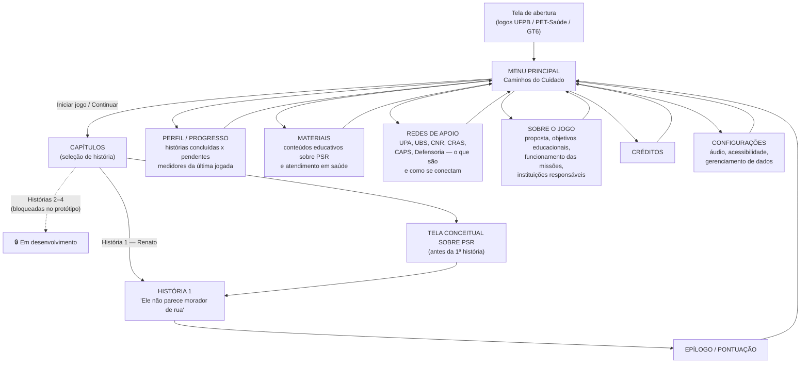
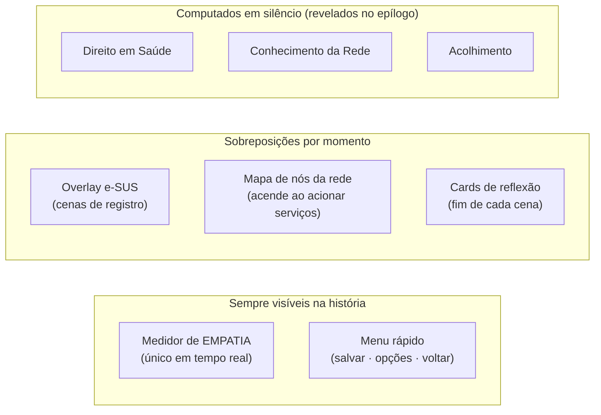

# Fluxograma de Navegação de Telas

**Projeto:** Visual novel educacional PET-Saúde Pop Rua (GT6) · **Versão:** 1.0 — 14/07/2026
**Formato:** Mermaid (texto versionável; renderiza no GitHub, VS Code e no pacote de apresentação). A ata de 01/07 pede o fluxograma "preferencialmente no Cacoo" — este diagrama é a fonte; o port para Cacoo é transcrição direta (prevista na S1 do cronograma).

---

## 1. Navegação geral (menus e telas)

## 2. Fluxo interno da História 1 (cenas 0–7 do roteiro)

```mermaid
flowchart TD
    C0["CENA 0 — Abertura\nUPA lotada · Renato chega\n(classificação amarela)\nsem escolha"] --> C1

    C1["CENA 1 — Decisão 0\n'Ele não deveria estar aqui'\n(recepcionista · senhora comenta)"] -->|A / B / C| R1["↻ Reflexão"]
    R1 --> C2

    C2["CENA 2 — Decisão 1\nA primeira impressão\n(médico · dados conflitantes)"] -->|A / B / C| S11["Sub 1.1 — endereço no e-SUS"]
    S11 --> S12["Sub 1.2 — a espera\n(técnica de enfermagem)"]
    S12 --> S13["Sub 1.3 — passagem de caso"]
    S13 --> R2["↻ Reflexão"] --> C3

    C3["CENA 3 — Decisão 2\nO que a ficha não diz"] -->|A / B / C| S21["Sub 2.1 — registro no e-SUS"]
    S21 --> S22["Sub 2.2 — a prescrição"]
    S22 --> R3["↻ Reflexão"] --> C4

    C4["CENA 4 — Decisão 3\nO intervalo que não é vazio\n(enfermagem · box, PA 168/104)"] -->|A / B / C| S31["Sub 3.1 — reavaliação\n(revela medo da alta)"]
    S31 --> S32["Sub 3.2 — prontuário (CIAP-2)"]
    S32 --> R4["↻ Reflexão"] --> C5

    C5["CENA 5 — Decisão 4\nA alta que começa antes da porta\n(mapa de nós da rede)"] -->|A / B / C| S41["Sub 4.1 — comunicando o plano"]
    S41 --> S42["Sub 4.2 — passagem ao Serviço Social"]
    S42 --> R5["↻ Reflexão"] --> C6

    C6["CENA 6 — Decisão 5\nA rede com nome e voz\n(ligação ao CNR / Marcos)"] -->|A / B / C| S51["Sub 5.1 — carteira vencida\n(Defensoria Pública)"]
    S51 --> R6["↻ Reflexão"] --> C7

    C7["CENA 7 — Decisão 6\nA despedida que fica\n('E se eu não encontrar o Marcos?')"] -->|A / B / C| CARD

    CARD["CARD DE CONTEXTO REAL\ndados MDHC 2023 · Portaria 940/2011\nCNR · CIAP-2 · Defensoria"] --> EPI

    EPI["EPÍLOGO\nrevela os 4 medidores\n+ mapa final dos nós"] --> DA & DB

    DA["DESFECHO A — 'Rede ativada'\nMarcos encontra Renato no coreto\n7 nós acesos"]
    DB["DESFECHO B — 'Recomeço do zero'\nRenato volta em 2 semanas\nrede apagada"]

    DA --> FIM["Volta ao menu\n(progresso salvo)"]
    DB --> FIM
```

## 3. HUD e sobreposições durante a história

---

### Notas de decisão
- **Tela conceitual sobre PSR** (pedida na ata) entra uma única vez antes da 1ª história; releitura disponível em **Materiais**.
- **Pontuação** não é tela isolada do menu: vive no **Epílogo** (fim da história) e no **Perfil/Progresso** (histórico persistente) — evita expor medidores durante o jogo, preservando a mecânica pedagógica.
- Os **7 nós de rede** da história 1: UPA · Serviço Social · CNR · Farmácia da UPA · UBS de referência · CRAS · Defensoria Pública.
- Todas as telas retornam ao menu principal; a história salva automaticamente ao fim de cada cena.
